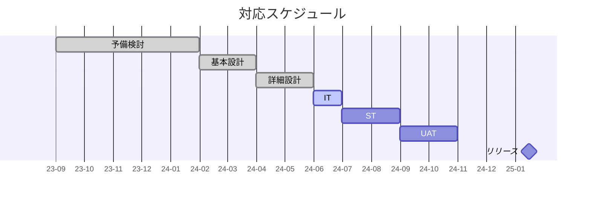

# SPAM

## <a name="SPAM更改">SPAM更改</a>

### 対応概要
AI基盤の保守期限到来に伴い、システム更改を実施。
プリンシプルのB象限であること、AI第6世代では占有区画で構築する必要があること、現状のElcaroを継続して利用する場合、ライセンス費用が高額になることを踏まえ、SWA基盤へ移行しデータベースはSWA Aurora(Postgres互換)に変更する。

### スケジュール

### 進捗概要
- 韓国法規制対応については、SWA-会社直契約のCustomer Agreementに対する追加契約(Addendum)を締結予定。
- Master CSP Assessment reportについては、東京リージョンを利用する場合は**利用出来ない**ことを法律事務所のアドバイザリーよりコメントあり。

## <a name="XIFプロトコル対応">XIFプロトコル対応</a>

### 対応概要
Vitinifer, SBEの取引IFで利用しているFOTプロトコルのEOLに伴い、後継となるプロトコルであるXIFプロトコルへの対応を行うもの。
香港拠点については、今次対応にて3rdパーティの取引ソースにも対応する。

### スケジュール

### 進捗概要
- 6月よりMasked XXX serviceにより、実取引のXIFプロトコルデータをUAT環境にIF開始。
- 3rd party sourceについては、六月末よりIF開始予定。

